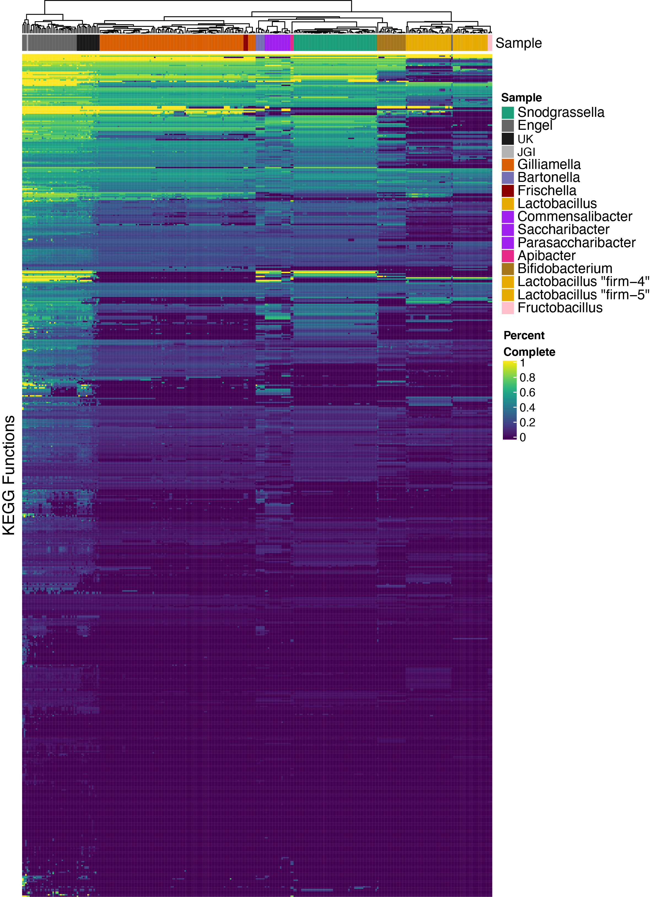

### What functions are in a normal microbiome?
For each sample (metagenome or isolate) and each function (KEGG Pathway or KEGG Module) I estimated "completeness" as a value of 0-1 representing how many genes in that function are present, as a proportion of all possible genes.
Using this vector of completeness values, I performed hierarchical clustering using Euclidean distances between samples.
Colors in the top row of the heatmap below correspond to species designation or metagenome source. The colors cluster together, indicating that the functions (gene content) within each species 

