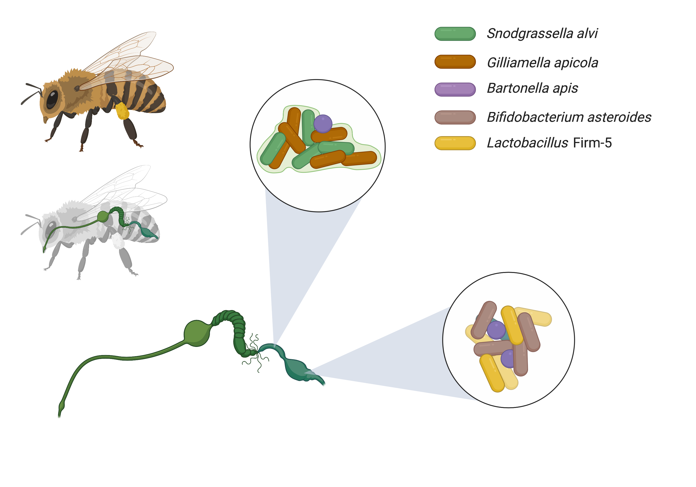
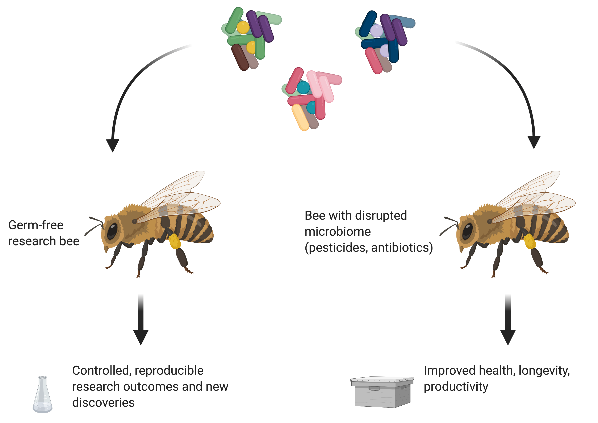

Host-associated bacterial communities can play important roles in host health. These communities are naturally complex, with hundreds or thousands of species present in varied abundances. This complicates microbiome research. 

"Defined communities" are used in research to simplify natural communties. These are collections of known species assembled to replace natural consortia.

But how do we choose which species to include? How do we know that our choices will be similar to the bacteria present in a "natural" microbiome?

To explore this question, I will use my preferred study system, the gut microbiome of honey bees (*Apis mellifera*). These social insects possess a conserved, and simple, microbiome that plays essential roles in bee health.

Thanks to previous researchers we have several important assets to support this approach:
1. Published metagenomes that deeply sequence the genetic diversity and gene content of individual bees
2. Hundreds of cultured isolates with whole genome sequences
3. Expert knowledge about which bacterial species are usual present

