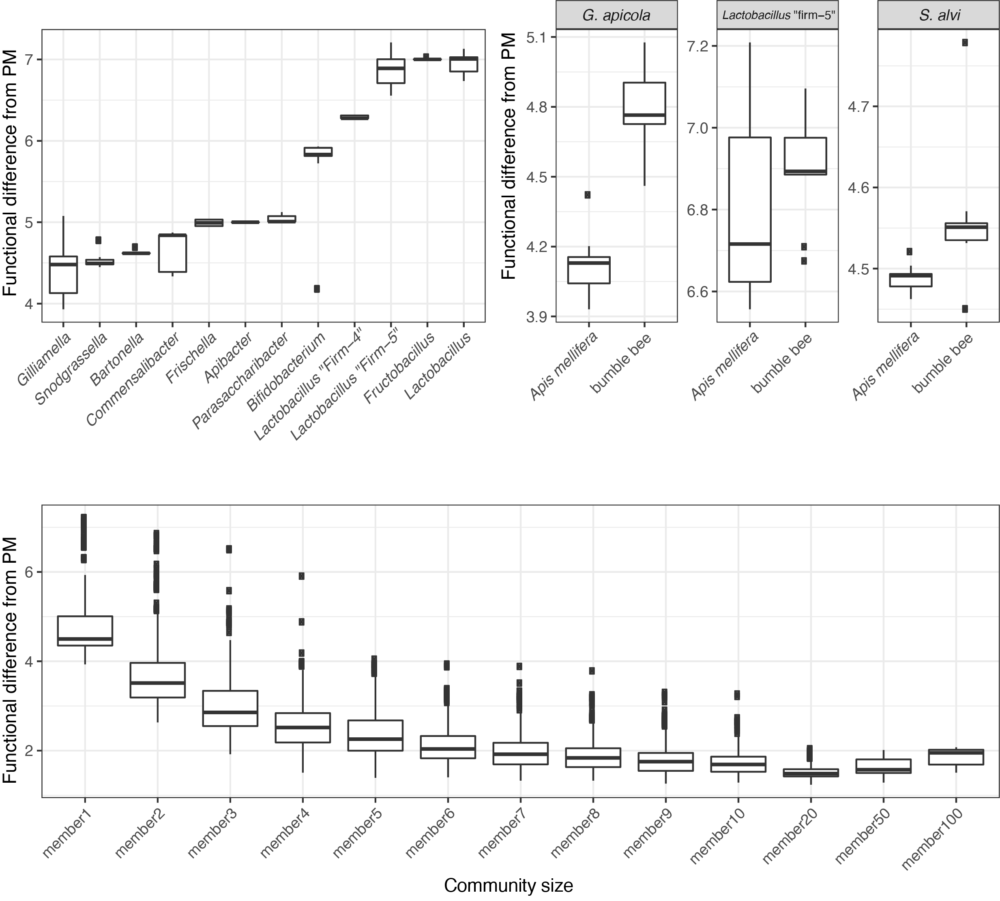

### How do we assemble communities?
A "community" here means more than one strain. To computationally assemble a community, I sample strains from my database, combine all their genes into a single list and recalculate functional completeness.  

### How do we assess these communities?
To assess how well these communities recapitulate a "normal" microbiome, I build a "standard" microbiome by averaging the functional completeness from (most) metagenome samples.

I now have two numeric vectors: one for the community, and one for the idealized metagenome. By calculating the euclidean distance between these vectors, I have a metric to assess how "complete" a given community is. 

