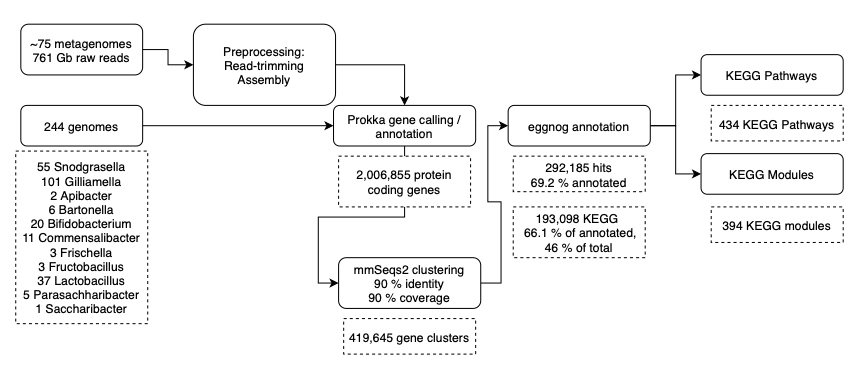

### The Plan
In this project I will use publically available data to 
1. estimate the functional composition of a "normal" bee gut microbiome 
2. assemble *in silico* communties of bee gut strains 
3. estimate how well designed communities recapitulate natural microbiomes  

### Datasets
I used three previously publishes sets of metagenomes from:
1. T. Regan, M. W. Barnett, D. R. Laetsch, S. J. Bush, D. Wragg, G. E. Budge, F. Highet, B. Dainat, J. R. de Miranda, M. Watson, M. Blaxter, T. C. Freeman, Characterisation of the British honey bee metagenome. Nat. Commun. 9, 4995 (2018). 
1. P. Engel, V. G. Martinson, N. A. Moran, Functional diversity within the simple gut microbiota of the honey bee. Proc. Natl. Acad. Sci. U. S. A. 109, 11002–11007 (2012).
1. K. M. Ellegaard, P. Engel, Genomic diversity landscape of the honey bee gut microbiota. Nature Communications. 10 (2019).

I downloaded isolate genomes from the NCBI Assembly database, computationally annotated some metadata through entrez, and then manually added additional metadata (host species).

