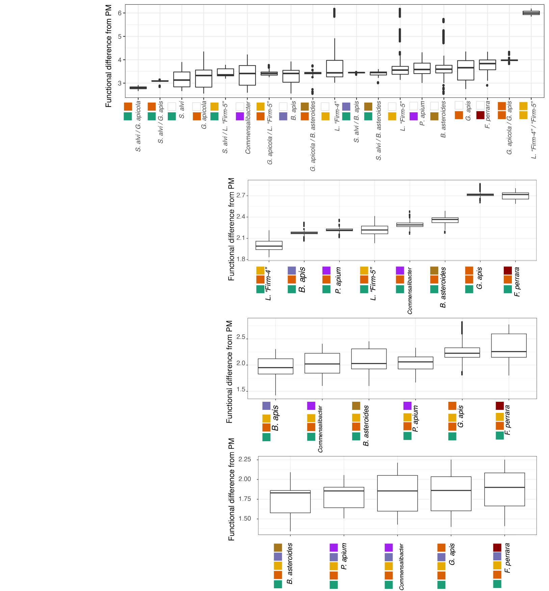

### So which communities should we use?

I next simulated thousands of communities of various sizes (2-, 3-, 4-, 5- members), and asked how similar they were to the "normal" microbiome.

For two membered communities, clearly a combination of *S. alvi* and *G. apicola* strains are best. As strains contribute new functional capacity, I can make recommendations for three, four, and five membered communities as well.

